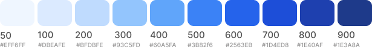
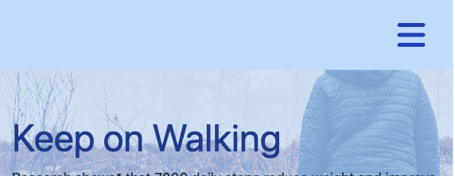
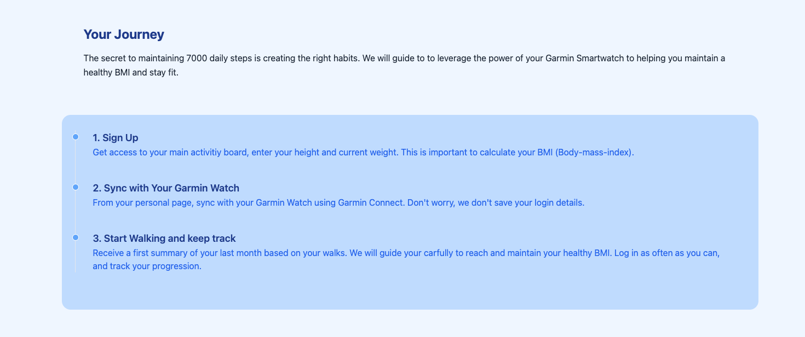
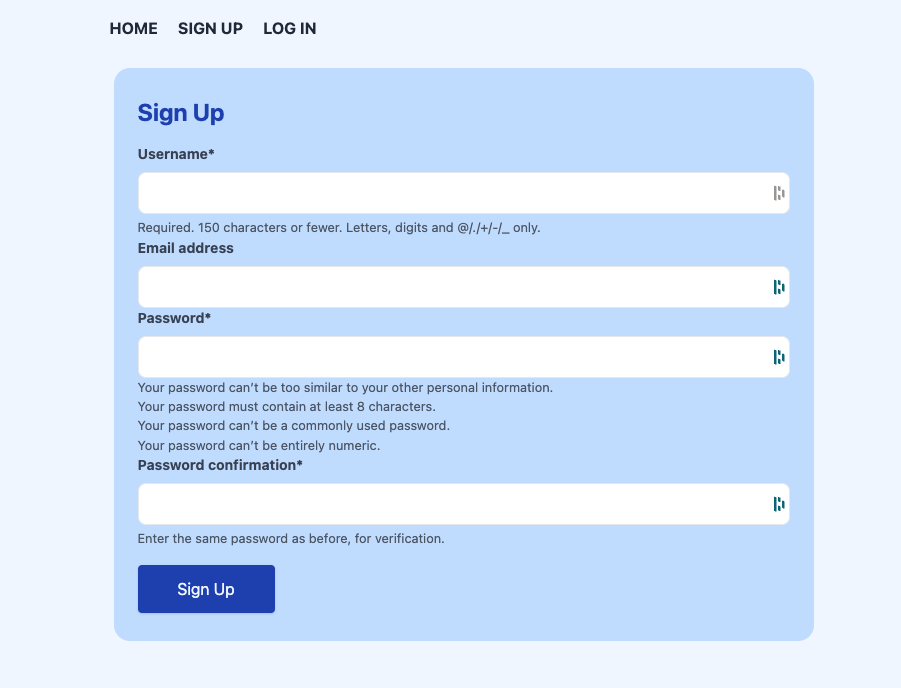
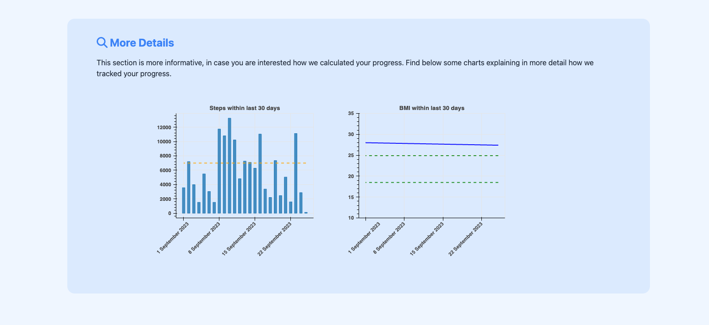
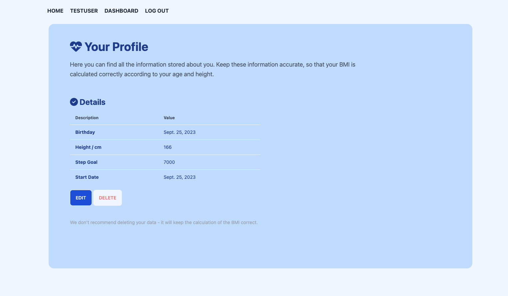
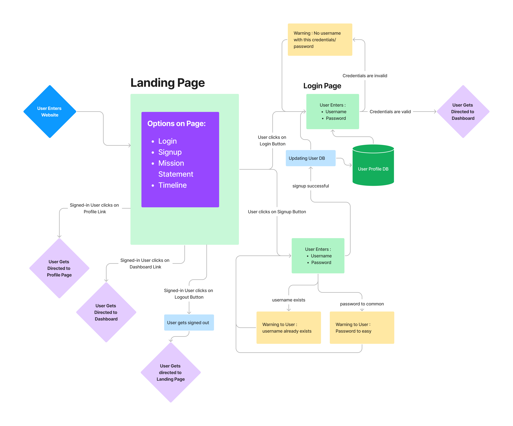

   

# _Keep on Walking_ - improve your health and happiness by daily walks

Have you walked 7000 steps today? According to science, a daily step count of 7000 steps is associated with increased happiness, mental health and improvement of various body parameters ( [Paluch, et. al., 2021](https://jamanetwork.com/journals/jamanetworkopen/fullarticle/2783711?utm_source=For_The_Media&utm_medium=referral&utm_campaign=ftm_links&utm_term=090321), [Choi, et. al., 2019](https://jamanetwork.com/journals/jamapsychiatry/article-abstract/2720689)). The aim of this website is to take up on this idea and promote health, fitness and happiness.

### Project Goal

- Users are encouraged to sign up and log their daily step count using their Garmin&copy; watch.
- The website will keep them on track with their step goal, and inform them if they are progessing in their goal of either reaching or maintaining a healthy BMI (body-mass-index).
- In addition, a simple statistic will be applied across all signed up users as to wheter meeting the targeted step count improves their health parameters, such as increased sleep times, reduced heart variability and reduced stress levels.

Link to live website : [Keep Walking](https://keep-walking-49be464b8318.herokuapp.com/)

  <div style='text-align:center'>
    <table style='width:90%; content-align:center'>
        <tr>
          <td>   </td>
        </tr>
    </table>
  </div>

   

**References:**

[1] _Paluch, Amanda E., et al. "Steps per day and all-cause mortality in middle-aged adults in the coronary artery risk development in young adults study." JAMA Network Open 4.9 (2021): e2124516-e2124516._

[2] _Choi, Karmel W., et al. "Assessment of bidirectional relationships between physical activity and depression among adults: a 2-sample mendelian randomization study." JAMA psychiatry 76.4 (2019): 399-408._

---

### Table of Content

- [_Keep on Walking_ - improve your health and happiness by daily walks](#keep-on-walking---improve-your-health-and-happiness-by-daily-walks)
  - [Project Goal](#project-goal)
  - [Table of Content](#table-of-content)
  - [User Experience (UX)](#user-experience-ux)
    - [User Stories](#user-stories)
    - [Website Aims](#website-aims)
    - [How these needs are addressed](#how-these-needs-are-addressed)
    - [Opportunities](#opportunities)
    - [Feature selection](#feature-selection)
  - [Agile Methodology](#agile-methodology)
  - [Design](#design)
    - [Color Scheme](#color-scheme)
    - [Typography](#typography)
    - [Imagery](#imagery)
  - [Wireframes](#wireframes)
  - [Features](#features)
  - [General Features](#general-features)
    - [Navbar](#navbar)
    - [Landing Page](#landing-page)
    - [Login/Signup Page](#loginsignup-page)
    - [Dashboard Page](#dashboard-page)
    - [Profile Page](#profile-page)
    - [Other Pages](#other-pages)
  - [Logic and Flow Diagrams](#logic-and-flow-diagrams)
    - [Landing Page](#landing-page-1)
    - [Dashboard Page](#dashboard-page-1)
    - [Profile Page](#profile-page-1)
    - [Future Implementations](#future-implementations)
    - [Accessibility](#accessibility)
  - [Models](#models)
  - [Technologies Used](#technologies-used)
    - [Languages](#languages)
    - [Frameworks](#frameworks)
  - [Deployment on Heroku](#deployment-on-heroku)
    - [Setup for the Backend (PostgreSQL / ElephantSQL)](#setup-for-the-backend-postgresql--elephantsql)
    - [Setup for Heroku](#setup-for-heroku)
    - [Setup for Cloudinary](#setup-for-cloudinary)
    - [How to Fork](#how-to-fork)
    - [How to Clone](#how-to-clone)
  - [Testing](#testing)
    - [Solved Bugs](#solved-bugs)
    - [Open Bugs](#open-bugs)
  - [Credits](#credits)
    - [Code Used](#code-used)
    - [Content](#content)
  - [Acknowledgements](#acknowledgements)

---

## User Experience (UX)

### User Stories

User stories are prioritized and categorized according to the _MuSCoW_ priortization principle, aiming for 60 % must-have User Stories in the first iteration. The first iteration of this project has 14 User stories:

- 8 must-have stories (**57 %** )
- 1 should-have story (**7 %** )
- 2 could-have stories ( **14 %**)
- 3 wont-have stories ( **21 %**)

| **#** | **USER STORY**                                                                                                                                                                                                                                                                                                                                                                                       | **PRIORITY** |
| ----- | ---------------------------------------------------------------------------------------------------------------------------------------------------------------------------------------------------------------------------------------------------------------------------------------------------------------------------------------------------------------------------------------------------- | ------------ |
| 1     | As a website user I can log in with a username/password so that I can access my personal area and my dashboard                                                                                                                                                                                                                                                                                       | Must-have    |
| 2     | As a signed in website user I can click on the logout button so that I sign out of my personal area and close the website                                                                                                                                                                                                                                                                            | Must-have    |
| 3     | As a website user I can create a new user account so that I can access my personal area                                                                                                                                                                                                                                                                                                              | Must-have    |
| 4     | As a signed in user I can view my step count and weight measurements of the recent time so that I am motivated to moving more and be on a good way of maintaining or reaching a healthy BMI (Body-mass-index)                                                                                                                                                                                        | Must-have    |
| 5     | As a signed in user I can give an emotional rating for each day so that (over time) I can find out whether increasing daily walks leads to increased happiness                                                                                                                                                                                                                                       | Must-have    |
| 6     | As a signed in user I can CRUD my emotional rating for each day so that I can correct a wrong mistakes, or delete my records from the database                                                                                                                                                                                                                                                       | Must-have    |
| 7     | As a signed in user I can load my health stats from my Garmin watch so that (over time) I can track my exact step count and my weight measurements from the Garmin App                                                                                                                                                                                                                               | Must-have    |
| 8     | As a signed in user I can CRUD my Garmin stats for each day so that I can correct a wrong reading (such as a wrong manual entry of weight in the App), or delete my records from the database                                                                                                                                                                                                        | Must-have    |
| 9     | As a website user I can upload a user profile picture so that the website is personalized and my testimonials look more personalized                                                                                                                                                                                                                                                                 | Could-have   |
| 10    | As a site admin I can create and run a simple statistical analysis whether increased step count is associated also with improved sleep patterns, reduced heart variablity and stress levels so that this creates further evidence of the main site goal and can be used to advertise the method on the main website (i.e. 'our users increase their sleep by xx per cent and reduced stress levels') | Could-have   |
| 11    | As a authenticated user I can give or reject my consent at any time to collect specific data (daily steps) so that the website can use this information anonymously to evaulate a cross-section of users whether increasing daily steps leads to loss of weight and more happiness                                                                                                                   | Should-have  |
| 12    | As a website user I can write a testimonial in my personal area so that I can express my opinion about the website to other users                                                                                                                                                                                                                                                                    | Won’t-have   |
| 13    | As a website admin I can approve or reject testimonials so that the approved testimonial will be displayed on the main page                                                                                                                                                                                                                                                                          | Won’t-have   |
| 14    | As a authenticated I can write a testimonal of my user experience so that other users can benefit from my experience and feel motivated to sign up or continue using the website                                                                                                                                                                                                                     | Won’t-have   |

---

### Website Aims

### How these needs are addressed

### Opportunities

### Feature selection

---

## Agile Methodology

This project was created following agile principles using the GitHub Projects board. User Stories / Epics were entered and categorized using the **MuSCoW** priotization method labelling them as follows:

- `must-have` : need to be implemented in this iteration
- `could-have` : if time permits, features and User Stories from this category can be delivered but they cannot be promised in this iteration
- `should-have` : User Stories in this category would be implemented only if the other stories are already implemented in this timebox
- `wont-have`: stories in this category will not be implemented in this iteration - but they are kept for documentation purpose

See below the final GitHub Project boards, after reaching the first Milestone (Project submission for assessment to Code Institute).

- All `must-have` stories were implemented
- **1** `should-have` story was implemented
- **2** `could-have` stories did not fit into the timebox and will be pushed to the next iteration
- **3** `wont-have` that would allow user to write testimonials about their website experience

<div style='text-align:center'>
   <table style='width:90%; content-align:center; '>
    <tr>
      <th colspan=2> GitHub Project Board </th>
    </tr> 
      <tr>
        <td >   </td>
      </tr>
       <tr>
        <td >   </td>
      </tr>
      <tr>
        <td >   </td>
      </tr>
    </table>
</div>

---

## Design

### Color Scheme

A light blue color scheme has been selected with the aim to create an energetic, positive atmosphere. The colours were chosen from Tailwind's carefully crafted color system to build this website.

Main Colours:

- A light blue was chosen as Background
- For text and subheadings, shades of dark gray were chosen over the black (`#fff`) to look less harsh on the eye
- For accents, a less aggressive contrast was chosen from Tailwinds CSS color palette to keep a harmonic overall visual impression.

The main reasoning of choosing these colors was to create an overall harmonic, playful emotion with only slight accents.

<div style='text-align:center'>
   <table style='width:90%; content-align:center'>
      <tr>
        <th> Type </th>
        <th> Color </th>
        <th> Used for</th>
      </tr>
      <tr>
        <td> Primary </td>
        <td  style='width:60%'>   </td>
        <td> Buttons, Backgrounds, Cards, Hover States, Headings </td>
      </tr>
      <tr>
        <td> Secondary </td>
        <td  style='width:60%'>   </td>
        <td> Text, Tables, Subheadings </td>
      </tr>
       <tr>
        <td> Accent </td>
        <td  style='width:60%; height:40%; text-align:left'>   </td>
        <td> Emotional Rating of Walks, Toasts, Warnings, Error </td>
      </tr>
    </table>
</div>

### Typography

The font was chosen from the `serif sans`font family. The aim of this selection was to create a harmonic and professional, clean tone. For all text and headings of the website, this font class was applied using the `font-sans` utility class from Tailwind CSS.

- Headings : `Sans-serif` 500/700 bold, 3rem, line-height 0.9
- Subheadings: `Sans-serif` 600 semibold, 1.125rem/1.25rem, line-height 1.5
- Text: `Sans-serif`, 400 light, 1rem, line-height 1.6

### Imagery

---

## Wireframes

Wireframes were created in [Figma](https://www.figma.com/), using a mobile-first approach. Wireframes were created for:

- Landing page
- User dashboard
- Small Components (Login/Signup Forms, Daily Activitites)

<div style='text-align:center'>
   <table style='width:90%; content-align:center; '>
    <tr>
      <th colspan=2> Wireframes for Home Page </th>
    </tr> 
      <tr>
        <th> Mobile </th>
        <th> Desktop </th>
      </tr>
      <tr>
        <td  style='width:25%; vertical-align:top'>   </td>
        <td  style='width:75%; vertical-align:top'>   </td>
      </tr>
    </table>
</div>

---

Wireframes for User dashboard:

<div style='text-align:center'>
   <table style='width:90%; content-align:center; '>
      <tr>
        <th colspan=2> Wireframes for User Dashboard</th>
      </tr> 
      <tr>
        <th> Mobile </th>
        <th> Desktop </th>
      </tr>
      <tr>
        <td  style='width:25%; vertical-align:top'>   </td>
        <td  style='width:75%; vertical-align:top'>   </td>
      </tr>
    </table>
</div>

Wireframes for individual Components:

<div style='text-align:center'>
   <table style='width:90%; content-align:center; '>
      <tr>
        <th colspan=2> Daily Activity Component</th>
      </tr>
      <tr>
        <th> Mobile </th>
        <th> Desktop </th>
      </tr>
      <tr>
        <td  style='width:40%; vertical-align:center'>   </td>
        <td  style='width:60%; vertical-align:center'>   </td>
      </tr>
      <tr>
        <th colspan=2>  Login/Sign Up Forms</th>
      </tr>
      <tr>
        <th> Signup </th>
        <th> Login </th>
      </tr>
      <tr>
        <td  style='width:50%; vertical-align:center'>   </td>
        <td  style='width:50%; vertical-align:center'>   </td>
      </tr>
    </table>
</div>

---

## Features

## General Features

The website consits of a landing page, and a personal area including a dashboard and a profile page, and a 404/403 page. All pages are responsive, designed using a mobile-first approach.

- `Landing Page` : this is the entry point where the website users arrive. From here, they can reach login/signup page to reach their personal page, or read general information about the project including a timeline, mission statement and a preview.
- `Login/Signup Page` : New users can sign up with a username/password, and users who already signed up can login with their details entering their login credentials here.
- `Dashboard`: Once logged in, users are directed to their personal dashboard, which includes a visual and textual summary of their latest walks, showing their progression in terms of BMI and body weight. Graphical visualizations of their step count progression and BMI are also here, and users find a form to synchronize their latest data with their Garmin watch.
- `Profile Page`: On the profile page, users can edit their information such as body height (cm), birthday and their step goal - theses information are important to calculate the BMI for them more precise. Users can also delete their profile from here.

The landing page is accessible for all users, whereas the Dashboard and Profile page can only be accessed by the User (and the site Admin) after signing in with their credentials. Any attempt for unauthorized access redirects directly to the 403 error page (unauthorized access).

### Navbar

On top of each page, a navbar is placed leading to sites available to the user.

- When a user is not signed in: links are displayed to `Home`, `Signup` and `Login` Screen
- When a user is signed in: links are displayed to `Home`, `Sign out`, `Profile` and `Dashboard`. The Profile link is displayed as name of the signed-in user and directs to their individual profile page.
- On large screen, each link is listed from top lef to middle of the screen
- On small screen, the navbar collaps to a Hamburger Button. When clicked, a list of links appears, as well as a Cross Icon to close the Hamburger Menu and return to the collapsed state.

<div style='text-align:center'>
   <table style='width:90%; content-align:center'>
      <tr>
      <td>   </td>
      </tr>
        <tr>
      <td>   </td>
      </tr>
        <tr>
      <td> 
       
         
         </td>
      </tr>
    </table>
</div>

### Landing Page

This site is the main entry point and is accessible for all users.

- It shows a hero image with a person walking, a main heading of the page and two CTA buttons
- When a user is not signed in, the CTA buttons lead to `Signup` and `Login` page to allow users fast access to the main functionality of the page
- When a user is signed in, the CTA buttons lead to the personal `Dashboard` or the `Logout` page
- Below the Hero image, the user can find the mission statement of the website, consisting of a brief intrductory summary of the site goal and three cards showcasing the main ethos of the page

<div style='text-align:center'>
   <table style='width:90%; content-align:center'>
    <tr>
        <th colspan=2> Landing Page (Top)</th>
      </tr>
      <tr>
      <td>   </td>
      </tr>
    </table>
</div>

On the middle of the landing page, a timeline is displayed that explains the user their journey through the page and what steps they will be expecting after they have signed up:

<div style='text-align:center'>
   <table style='width:90%; content-align:center'>
    <tr>
        <th colspan=2> Landing Page (Middle)</th>
      </tr>
       <tr>
      <td>   </td>
      </tr>
    </table>
</div>

On the bottom of the page, a preview is presented to allow a new user to form an expectation of the site content and to motivate them to sign up. It also displays :

- The number of users that have been active at least once in the current month
- The average BMI of those users and their average change of BMI(absolute value)
- The percentage (%) of active users that have either maintained or improved their BMI in the past month

<div style='text-align:center'>
   <table style='width:90%; content-align:center'>
    <tr>
        <th colspan=2> Landing Page (Bottom)</th>
      </tr>
       <tr>
      <td>   </td>
      </tr>
    </table>
</div>

### Login/Signup Page

- New users can sign up on the website using the Signup Form.
- If the username already exists, the user is prompted to choose a different, unique username
- If the password is too common, i.e. `password` or `1234` the user will be asked to provide a more safe password with instructions on minimal requirement for a safe password
- Users that have already signed up, can head to the Login page and enter their credentials
- If the combination of username/password is valid and exists in the DB, the user will be directed to the personal dashboard and profile linked to that user
- If the password does not match or the username does not exist, the user will receive feedback that the provided combination has been invalid.

<div style='text-align:center'>
  <table style='width:90%; content-align:center'>
    <tr>
      <td> 
         
         
      </td>
    </tr>
  </table>
</div>

### Dashboard Page

This is the central page of a signed-in user where the user can interact with the main functionalities of the website, and read a brief summary from the data analysis of their personal progress.

A banner on top of the Dashboard greets the user with their username aimed to create a postitive emotion and a feeling of welcome.

<div style='text-align:center'>
  <table style='width:100%; content-align:center'>
      <tr>
        <th colspan=2> Dashboard Page (Top)</th>
      </tr>
      <tr> <td>   </td> </tr>
  </table>
</div>

In the middle of the Dashboard Page, the user can interact with a component that allows user adding their data using two different methods :

- (Default) Sync with their Garmin smartwach. Users can sync their data with the data stored in their Garmin App. By providing their Garmin username/password and clicking the `sync` button, an asynchroneous request is sent to the Garmin API.
- (Optional) Manually entering walks. When a user does not have a Garmin Watch or Garmin Connect account, or prefers not to use the default feature, they can still enter their walks manually. The form for adding the data manually is swapped without reloading using `htmx-swap`

<div style='text-align:center'>
  <table style='width:100%; content-align:center'>
      <tr>
        <th colspan=2> Dashboard Page (Middle)</th>
      </tr>
      <tr> <td>   </td> </tr>
      <tr> <td>   </td> </tr>
  </table>
</div>

If the synchronization was successfull, the data `JSON` received from the Garmin API is then processed in the `View` , where the data is entered in the `GarminData` DB table. The page is also updated without reloading (since htmx uses AJAX in the background) displaying the latest walks.

- If the synchronization was not successful, a toast displaying the error appears on top of the screen with the error message
- A paginated list of the most recent walks is displayed, allowing the user to get a quick overview of their recent activity and step counts of the last 7 days. The list contains:
  - General information about daily activities such as : Date, number of steps (as extracted from Garmin API) and body weight (as entered inside the Garmin Connect App)
  - The user can give and modify an emotional rating of the day (via `htmx-post` request that updates the DB without reloading the page )
  - For each activity, the user can press an `Edit` button to update missing or wrong entries (such as, if the watch was charging but the user did go for walk - an estimated step count is still closer than zero steps).
  - For each activity, the user has the option to entirely delete the activty if they desire so. Upon pressing the `Delete` button, a confirmation modal pops up (using `htmx-confirm`). If confirmed, the entry is deleted from the DB and the activites are loaded in-place (using `htmx-delete` requests)

On the bottom of the Dashboard page, the user can read a personalized summary that is based on data processing and simple linear regression of the data provided in the DB. The data processing pipeline informs the user :

- The progress towards a healthy BMI : The user receives information about their average BMI and the linear trend of the BMI over the past month. A friendly reminder is written when BMI is too high, too low. If the BMI has worsed over the past month, the user is informed with motivating words to walk more, and the user get positive feedback when the BMI change has been improving towards a healthy range.
- Summary of the Average body weight (kg) over the past month
- Summary over the average emotional rating over the past month
- Additionally, two graphs are displaying the recent step counts over the past 30 days. When hover over the bar plot, the individual DB entry is displayed.
  - The first plot is a bar plot showing the step count over the past months. A second line plot is overlayed that shows the 7000 steps and gives the user a feeling of whether they achieved or not the targeted step count.
  - The second plot visualizes the BMI development over the past month. In addition, the healthy BMI range is plotted as a green interval, giving the user a feeling of achievment when they see their BMI line reaching the healthy levels, motivating them to keep walking.

<div style='text-align:center'>
  <table style='width:100%; content-align:center'>
      <tr> <th colspan=2> Dashboard Page (Bottom)</th> </tr>
      <tr> <td>   </td> </tr>
      <tr> <td>   </td> </tr>
  </table>
</div>

---

### Profile Page

On the Profile page, users can update the information stored about them. The user can enter this page only after authentication, otherwise an access attempt would redirect to the 403 page.

Two buttos allow the users to interact with the page:

- `Edit button` : allows the user to modify key information necessary to calculate the correct progression of this summary, namely the `height (cm)` and their `date of birth` (to correct the healthy BMI range for age and body height).
- When edit was successful, a toast appears on top of the screen to confirm that the DB has been updated successfully.
- `Delete` button : This button triggers a modal for the user to confirm deleltion of their profile. It also includes a warning that this action cannot be undone. If confirmed, the user is deleted from the DB and the user receives a confirmation message that his profile and account has been deleted.

<div style='text-align:center'>
    <table style='width:90%; content-align:center'>
      <tr> <th colspan=2> Profile Page</th> </tr>
      <tr> <td>   </td> </tr>
      <tr> <td>   </td> </tr>
      <tr> <td>   </td> </tr>
  </table>
</div>

### Other Pages

This page contains a friendly message when the 404 and 403 server error have occured.

- 404 page: appears when the user enters a URL that does not exist
- 403 page: appears when users try to enter a site that they have no authorization for

<div style='text-align:center'>
    <table style='width:90%; content-align:center'>
      <tr>
      <td>   </td>
      </tr>
      <tr>
      <td>   </td>
      </tr>
    </table>
</div>

---

## Logic and Flow Diagrams

### Landing Page

See below a flow Diagram for the Landing Page and the Login/Signup Routes.

- When user enters the site, they will be directed to the Home Page
- the 'Login' or 'Signup' Buttons direct to the Login and Signup Page.
- New site users can sign up providing a username/password combination.
- Users that have already signed-up users can login using their credentials in order to access their personal area.

<div style='text-align:center'>
  <table style='width:90%; content-align:center'>
    <tr>
        <th colspan=2> Flow Diagram for Landing Page</th>
    </tr>
    <tr>
      <td> 
        
      </td>
    </tr>
  </table>
</div>

---

### Dashboard Page

The user can enter this page only after authentication, otherwise an access attempt would redirect to the 403 page.

- Signed-in users can submit their Garmin credentials in the `Sync Garmin` form, in order to retrieve their latest health stats from the Garmin API.
- Signed-in users that don't have a Garmin watch (or prefer to enter their walks manually) have the option to enter their walks manually (without reloading the page as all `POST` requests are handled with `htmx-post`)
- Users can give emotional rating for each day by clicking on the rating symbols next to each activity, which is updating the DB without reloading the page (thanks to htmx-AJAX requests).
- Users can read, edit and delete any of their dailiy activities by clicking on 'edit' or 'delete' buttons next to each activity.
- Users can sign out by clicking on the 'Logout' link in the navbar, return to the main page by clicking on 'Home' link, or go their profile page using the 'Profile' link.

<div style='text-align:center'>
  <table style='width:100%; content-align:center'>
      <tr>
        <th colspan=2> Flow Diagram for Dashboard Page </th>
      </tr>
      <tr> <td>   </td> </tr>
  </table>
</div>

---

### Profile Page

The user can enter this page only after authentication, otherwise an access attempt would redirect to the 403 page.

- Signed-in users can edit their profile details that are stored about them in the DB
- They also have the option here to delete their profile. In order to avoid unwanted deletion, the user needs to confirm in a modal that they wish to do so. They are also warned that this operation cannot be done as is deletes any record about them from the DB (no soft deletion is implemenented as per definition of the project scope).

<div style='text-align:center'>
    <table style='width:90%; content-align:center'>
      <tr> <th colspan=2> Flow Diagram for Profile Page</th> </tr>
      <tr> <td>   </td> </tr>
  </table>
</div>

---

### Future Implementations

- Scalability: Garmin offers a vast range of body parameters that the website could use for the benefit of the user, such as tracking their sleep habits, stress levels or heart rate variability. Currently, this is not implemented as the project scope was creating a Minimum-Viable-Product (MVP) focussing on the step count and body weight.
- Compatibility: Currently, this application works only with Garmin Devices, which is not a huge limitation as Garmin&copy; is the leading brand for sports/smartwatches using GPS tracking. This website works with each model of Garmin as it synchronizes the data via Garmins API to their Connect&copy; App. A next iteration of this project would be to allow users to use other brands, such as Samsung&copy; or FitBit&copy;
- Cross-user data analysis: This project could be embedded into a wider research project that could study various body parameters across users under certain conditions. This would however require implementing GDPR compliance, including steps to provide privacy information and obtaining written consent of the users for their data to be used for that purpose - which is currently beyond the MVP scope of the this educational project.
- Testimonials: A next iteration would include a User Testimonial section where Users could report their journey and experience with the site. They could report whether keeping track of their body parameters helped them reaching or maintaining a healthy BMI.

---

### Accessibility

---

## Models

User data are stored in a relational database. The main model has been carefully designed to allow for emotional ratings and API calls from the Garmin Connect App:

- **User**: each row is a user that has signed up on the website
- **UserProfile**: each row is a profile where the user can enter more details (height, date of birth, profile picture)
- **GarminData**: each row is an entry as read from the Garmin API for a specific date and user
- **UserAverage** each row is a sample from recent user stats (average weight, average BMI and BMI trend over past month)

<table style='width:90%; content-align:center'>
    <tr>
       <td>   </td>
    </tr>
</table>

---

## Technologies Used

- [DrawSQL](https://drawsql.app/) to draw ERD diagram for the DB tables
- Git / [Github](https://github.com/) for Version Control
- [VS Code ](https://code.visualstudio.com/) as local IDE
- [Figma](https://www.figma.com/) for Wireframs and Flowcharts
- [Shields.io](https://shields.io/) for Readme badges
- convert markdown tables to html via [HTML Table Converter](https://tableconvert.com/markdown-to-html)
- [Prettier](https://marketplace.visualstudio.com/items?itemName=esbenp.prettier-vscode) VS Code formatter
- [python-garminconnect](https://github.com/cyberjunky/python-garminconnect/tree/master) for Garmin API calls
- [icecream](https://github.com/gruns/icecream) for more expressive print statements
- [black](https://github.com/psf/black) for code formatting
- [AlpineJS](https://alpinejs.dev/) for dynamic event handling
- [DaisyUI](https://opencollective.com/daisyui) components for Tailwind

### Languages

- HTML
- CSS
- Python
- Javascript

### Frameworks

- [Django](https://www.djangoproject.com/) for backend server
- [Tailwind CSS](https://tailwindcss.com/) for frontend / UI / CSS
- [Pytest](https://docs.pytest.org/en/7.4.x/) for Unit Testing
- [htmx](https://htmx.org/) for AJAX requests without re-loading the page

---

## Deployment on Heroku

The deployment consists of 2 steps :

1.  setting up backend DB (PostgreSQL)
2.  setting up Heroku app and connect to DB

### Setup for the Backend (PostgreSQL / ElephantSQL)

- Create ElephantSQL account (if needed) and login on website
  - click on `create New Instance` and choose a name (recommend not using `-` or `.` in the name - that seems to cause issues)
  - use `Tiny Turtle` plan, leave Tags empty. Then select region
  - enter the new project from dashboard and copy the URL into your `env.py` template of the `DATABASE_URL` variable
- open the `settings.py` of your main django project and update the `DATABASE_URL`

```python

 DATABASES = {
     'default': dj_database_url.parse(os.environ.get("DATABASE_URL"))
 }
```

- To confirm that we can now connect to the BD hosted on ElephantSQL, Run the migration command in your terminal to migrate your database structure to the newly-connected ElephantSQL database

```
python manage.py makemigrations
python manage.py migrate
```

### Setup for Heroku

- Login to Heroku Website and Create a new App (EU)
- Connect the App with your GitHub Repository on the Heroku Website
- a `SECRET_KEY` can be generated and copied from here [Django Secret Key Generator](https://miniwebtool.com/django-secret-key-generator/)
- the `DATABASE_URL` is taken from your ElephantSQL project as described above (copy entire `URL`)
- the `CLOUDINARY_URL` is taken from the cloudinary website as described below (copy API Environment Variable)
- Go to `Settings > Config Vars` and enter your secret environment variables from your `env.py` using the following variables:

```python
  SECRET_KEY=SECRET_KEY
  DATABASE_URL=DATABASE_URL
  CLOUDINARY_URL=CLOUDINARY_URL
  PORT=8000
  DISABLE_COLLECTSTATIC=1
  DEBUG=False
```

### Setup for Cloudinary

- Go to Cloudinary website and create an account
- Go to dashboard and copy `API Environment Variable` to clipboad. This will be used to connect the django app to the cloudinary storage. Set this key as your environment variable `CLOUDINARY_URL`

### How to Fork

- Log into GitHub and navigate to this repository
- Click on the "Main" Branch button and type the name of the forked branch
- Click on "Create Branch" to confirm

### How to Clone

- Click on the "Code" button and copy the link to this repository
- open terminal on your machine and navigate to the folder you want to store a local copy
- in the terminal, type 'git clone ' followed by the link you copied
- press enter to confirm

---

## Testing

This website was tested using a mix of manual and automated tests for several apsects of this Django application. The results were documented in [TESTING.md](./TESTING.md). The testing scope was:

- ... User Stories
- ... Authentication
- ... Functionality
- ... Usability
- ... Accessibility
- ... Synatx
- ... Accessibility

In addition, this application was mostly developed using a `test-driven development` (TDD) approach using the `pytest` and `Jest` frameworks for Python and JavaScript. Results of of the unit tests are documented in same document above. The reasons for TDD is to

- ... ensure core functionality
- ... better code re-usability
- ... better code readibility by enforcing smaller functions.

All of the `pytest` test cases were also integrated in a [GitHub actions](https://github.com/features/actions) workflow that runs all tests for each pull request and push to the main branch, spotting erros in the code early on.

### Limitation

No automated tests were created for functions to render the bar charts and line plots and for the API calls. While this should be included in a future version, these were only tested manually was deemed beyond the scope being mindful about the time frame to complete the MVP for this iteration.

---

### Solved Bugs

- In a first iteration of this project, I made a mistake in the Model design where I kept the emotional rating linked to the readout from the Garmin device. This has made my life _very_ difficult creating `POST` requests and handling the CRUD functionality.
  <div style='text-align:center'>
    <table style='width:90%; content-align:center'>
        <tr>
          <td>   </td>
        </tr>
    </table>
  </div>

  - **Solution** : After some research (see acknowledgements), it turned out to be the best advice to go back to the Model diagram and simplify the design. In this way, the data structures reflect much better the data flow inside Django's MVT architecture. The final solution was to split the `DailyActivity` table into a `GarminData` table (readouts from the Garmin API) and a `EmotionRating` table, so that both are linked to independent requests. Also, CRUD operations for each table are independent, which is not only more natural but also leads to a cleaner implementation.

- When comparing dates (in a View to check whether a record of a specific date already exists), the date was stored as `pandas` `Timestamp` object but the fields in the `GarminData` Model where `datetime` objects. Consequently, the comparison failed because python could not compare two different data types.

  ```python
  [... datetime.date(2023, 9, 1), datetime.date(2023, 9, 1), ...]
  [Timestamp('2023-08-30 00:00:00'), Timestamp('2023-08-31 00:00:00' ... ]
  ```

  - **Solution** : The solution was to convert pandas `Timestamp` objects using `pandas.date.date()` function to convert them to `datetime` objects - then the dates could be compared in the View.
    ```python
        time_diff = pd.date_range(start=start_date, end=end_date)
        return [date.date() for date in time_diff]
    ```

### Open Bugs

---

## Credits

### Code Used

- Garmin API calls based on example files and documentation from [cyberjunky : Python: Garmin Connect](https://github.com/cyberjunky/python-garminconnect/tree/master)
- User and Login/Logout functionality using a Custom User Model : [LearnDjango - Django Best Practices: Custom User Model](https://learndjango.com/tutorials/django-custom-user-model)
- To retrieve a custom attribute when clicking a button while using also arrow functions : [Stackoverflow - $(this) is selecting window object instead of clicked element jquery [duplicate]](https://stackoverflow.com/questions/49449325/this-is-selecting-window-object-instead-of-clicked-element-jquery)
- Cookie setup for handling CSRF Tokens when using AJAX [Github](https://github.com/realpython/django-form-fun/blob/master/part1/main.js) as referenced in this blog post [Django and AJAX Form Submissions – Say 'Goodbye' to the Page Refresh](https://realpython.com/django-and-ajax-form-submissions/)
- used configuration from yml file for tox and django as starting point : [Cards (B. Okken)](https://github.com/okken/cards) , [SnyPy Backend](https://github.com/snypy/snypy-backend/blob/master/.github/workflows/test.yml)

### Content

- All of the content was written by myself.
- Externally used code (such as code snippets from stackoverflow) in this project are referenced in this Readme and inside the HTML / CSS / JS / Python source code.

## Acknowledgements

- Teaching and Support from Code Insitute [Code Insitute](https://codeinstitute.net/)
- Convert Excel Tables (User Stories) into Markdown format [Link to TableConvert](https://tableconvert.com/)
- How to approach designing Django Models :
  - DjangoGirls online tutorial : [Django models](https://tutorial.djangogirls.org/en/django_models/)
  - LearnDjango Blog from W. Vincent [Django Best Practices: Models](https://learndjango.com/tutorials/django-best-practices-models)
  - I've spent a fair amount of time researching how Models work. Here a selection of blog Articles and Youtube videos that contributed to my understanding :
    - Klement Omeri : [Best practices and tips to build better Django models (Medium)](https://medium.com/@daspiyush0_44431/best-practices-and-tips-to-build-better-django-models-c0f78cd4e52e)
    - Sagar Chopade: [Django Model Best Practices: Tips and Tricks for Clean and Efficient Code (Medium)](https://medium.com/@schopade333/django-model-best-practices-c5c8a142dfc)
    - Sagar Chopade: [Custom Model Managers In Django (Medium)](https://medium.com/scalereal/custom-model-managers-in-django-2dac30acdf55)
    - Ben Lopatin/ Cobey Potter, 'This Old Pony', Wellfire Interactive : [The problem with fat models, or, an OOPs mistake](https://wellfire.co/this-old-pony/the-problem-with-fat-models--or--an-oops-mistake--this-old-pony-69/)
    - Jair Verçosa [Django model Guideline (Medium)](https://jairvercosa.medium.com/django-model-guideline-d48a96c9b38c)
    - Aravind Srinivas [Essential Tips for Optimizing Your Django Models for Better Code Readability (Medium)](https://awstip.com/essential-tips-for-optimizing-your-django-models-for-better-code-readability-f1a22665fe25)
    - Michał Macura (Soft Kraft) : [Django Best Practices — Refactoring Django Fat Models](https://www.softkraft.co/django-best-practises/)
    - Matt Freire, [Learn the basics of Django's Model Managers and Querysets - YouTube](https://www.youtube.com/watch?v=rjUmA_pkGtw)
    - Tarun Garg [Design Django models such that your future self will thank you - YouTube](https://www.youtube.com/watch?v=dXCh8m4P5Tc)
- Tutorial about various aspects using HTMX library for dynamic POST requests :
  - Installing HTMX and basic usage [BugBytes - Django and HTMX #1 - Introduction to HTMX and Dynamic AJAX Requests](https://youtu.be/Ula0c_rZ6gk?feature=shared)
  - Updating DB using HTMX [Django and HTMX #3 - Listing and Creating Items (with no refresh!)](https://youtu.be/H_m1g8XOtHY?feature=shared)
  - Deleting from DB using HTMX [Django and HTMX #4 - Deleting Items (with no refresh!)](https://youtu.be/qk1gVbnaOAc?feature=shared)
  - Django messages with HTMX swap [HTMX, AlpineJS and Django Messages - Adding Toast / Alert messages in HTMX Responses](https://youtu.be/T7TgfRiRb10?feature=shared)
- How to use Django's signals to automatically create a User Profile at signup: [Automatically Create User Profiles - Django Wednesdays Twitter #3](https://youtu.be/H8MmNqDyra8?feature=shared)
- How to use factoryboy with pytest for testing functions (Very Academy) [Pytest | Django | Introducing Factory Boy and Faker - Fixture Replacement](https://youtu.be/qrvqNdCDKjM?feature=shared)
- How to dismiss dynamic events such as toasts using AlpineJS [Youtube - HTMX, AlpineJS and Django Messages - Adding Toast / Alert messages in HTMX Responses](https://youtu.be/T7TgfRiRb10?feature=shared)
- Setup of automatic tests using Github Actions and pytest
  - Okken, Brian. "Python Testing with pytest." (2nd ed.) Pragmatic Bookshelf, 2022.
  - Automated Testing in Python with pytest, tox, and GitHub Actions [mCoding (Youtube) ](https://www.youtube.com/watch?v=DhUpxWjOhME)
- Thanks to my mentor Ronan (Code Institute) for his advices and clear feedback
