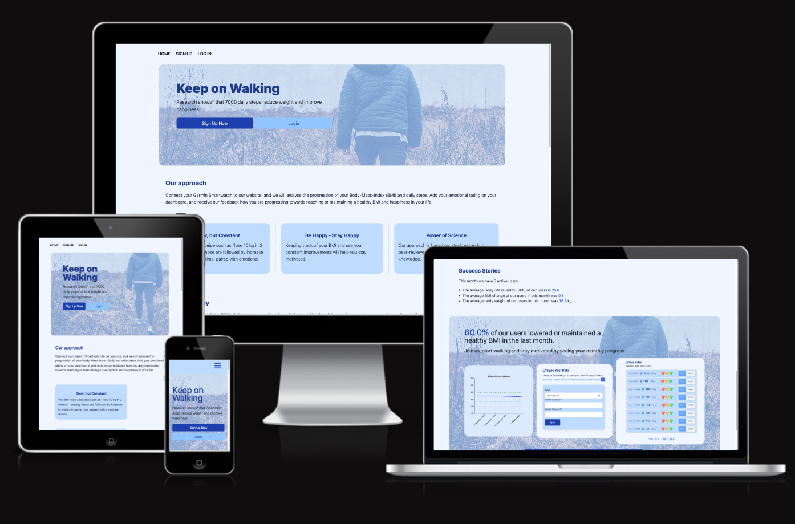

   

# _Keep on Walking_ - improve your health and happiness by daily walks

Have you walked 7000 steps today? According to science, a daily step count of 7000 steps is associated with increased happiness, mental health and improvement of various body parameters ( [Paluch, et. al., 2021](https://jamanetwork.com/journals/jamanetworkopen/fullarticle/2783711?utm_source=For_The_Media&utm_medium=referral&utm_campaign=ftm_links&utm_term=090321), [Choi, et. al., 2019](https://jamanetwork.com/journals/jamapsychiatry/article-abstract/2720689)). The aim of this website is to take up on this idea and promote health, fitness and happiness.

### Project Goal

- Users are encouraged to sign up and log their daily step count using their Garmin&copy; watch.
- The website will keep them on track with their step goal, and inform them if they are progessing in their goal of either reaching or maintaining a healthy BMI (body-mass-index).
- In addition, a simple statistic will be applied across all signed up users as to wheter meeting the targeted step count improves their health parameters, such as increased sleep times, reduced heart variability and reduced stress levels.

Link to live website : [Keep Walking](https://keep-walking-49be464b8318.herokuapp.com/)

  <div style='text-align:center'>
    <table style='width:90%; content-align:center'>
        <tr>
          <td>   </td>
        </tr>
    </table>
  </div>

   

**References:**

[1] _Paluch, Amanda E., et al. "Steps per day and all-cause mortality in middle-aged adults in the coronary artery risk development in young adults study." JAMA Network Open 4.9 (2021): e2124516-e2124516._

[2] _Choi, Karmel W., et al. "Assessment of bidirectional relationships between physical activity and depression among adults: a 2-sample mendelian randomization study." JAMA psychiatry 76.4 (2019): 399-408._

---

### Table of Content

- [_Keep on Walking_ - improve your health and happiness by daily walks](#keep-on-walking---improve-your-health-and-happiness-by-daily-walks)
  - [Project Goal](#project-goal)
  - [Table of Content](#table-of-content)
  - [User Experience (UX)](#user-experience-ux)
    - [User Stories](#user-stories)
    - [Website Aims](#website-aims)
    - [How these needs are addressed](#how-these-needs-are-addressed)
    - [Opportunities](#opportunities)
    - [Feature selection](#feature-selection)
  - [Design](#design)
    - [Color Scheme](#color-scheme)
    - [Typography](#typography)
    - [Imagery](#imagery)
  - [Wireframes](#wireframes)
  - [Features](#features)
    - [General Features](#general-features)
      - [1. Landing Page](#1-landing-page)
      - [2. Login/Signup Page](#2-loginsignup-page)
      - [3. Dashboard](#3-dashboard)
      - [4. Profile Page](#4-profile-page)
    - [Future Implementations](#future-implementations)
    - [Accessibility](#accessibility)
  - [Models](#models)
  - [](#)
  - [Technologies Used](#technologies-used)
    - [Languages](#languages)
    - [Frameworks](#frameworks)
  - [Deployment](#deployment)
    - [1. DB Setup (PostgreSQL / ElephantSQL)](#1-db-setup-postgresql--elephantsql)
    - [2. Heroku Setup](#2-heroku-setup)
      - [How to Fork](#how-to-fork)
      - [How to Clone](#how-to-clone)
    - [Deployment on Heroku](#deployment-on-heroku)
    - [2. Heroku Setup](#2-heroku-setup-1)
  - [Testing](#testing)
    - [Testing Procedure](#testing-procedure)
    - [Solved Bugs](#solved-bugs)
    - [Open Bugs](#open-bugs)
  - [Credits](#credits)
    - [Code Used](#code-used)
    - [Content](#content)
  - [Acknowledgements](#acknowledgements)

---

## User Experience (UX)

### User Stories

User stories are prioritized and categorized according to the _MuSCoW_ priortization principle, aiming for 60 % must-have User Stories in the first iteration. The first iteration of this project has 14 User stories:

- 8 must-have stories (**57 %** )
- 1 should-have story (**7 %** )
- 2 could-have stories ( **14 %**)
- 3 wont-have stories ( **21 %**)

| **#** | **USER STORY**                                                                                                                                                                                                                                                                                                                                                                                       | **PRIORITY** |
| ----- | ---------------------------------------------------------------------------------------------------------------------------------------------------------------------------------------------------------------------------------------------------------------------------------------------------------------------------------------------------------------------------------------------------- | ------------ |
| 1     | As a website user I can log in with a username/password so that I can access my personal area and my dashboard                                                                                                                                                                                                                                                                                       | Must-have    |
| 2     | As a signed in website user I can click on the logout button so that I sign out of my personal area and close the website                                                                                                                                                                                                                                                                            | Must-have    |
| 3     | As a website user I can create a new user account so that I can access my personal area                                                                                                                                                                                                                                                                                                              | Must-have    |
| 4     | As a signed in user I can view my step count and weight measurements of the recent time so that I am motivated to moving more and be on a good way of maintaining or reaching a healthy BMI (Body-mass-index)                                                                                                                                                                                        | Must-have    |
| 5     | As a signed in user I can give an emotional rating for each day so that (over time) I can find out whether increasing daily walks leads to increased happiness                                                                                                                                                                                                                                       | Must-have    |
| 6     | As a signed in user I can CRUD my emotional rating for each day so that I can correct a wrong mistakes, or delete my records from the database                                                                                                                                                                                                                                                       | Must-have    |
| 7     | As a signed in user I can load my health stats from my Garmin watch so that (over time) I can track my exact step count and my weight measurements from the Garmin App                                                                                                                                                                                                                               | Must-have    |
| 8     | As a signed in user I can CRUD my Garmin stats for each day so that I can correct a wrong reading (such as a wrong manual entry of weight in the App), or delete my records from the database                                                                                                                                                                                                        | Must-have    |
| 9     | As a website user I can upload a user profile picture so that the website is personalized and my testimonials look more personalized                                                                                                                                                                                                                                                                 | Could-have   |
| 10    | As a site admin I can create and run a simple statistical analysis whether increased step count is associated also with improved sleep patterns, reduced heart variablity and stress levels so that this creates further evidence of the main site goal and can be used to advertise the method on the main website (i.e. 'our users increase their sleep by xx per cent and reduced stress levels') | Could-have   |
| 11    | As a authenticated user I can give or reject my consent at any time to collect specific data (daily steps) so that the website can use this information anonymously to evaulate a cross-section of users whether increasing daily steps leads to loss of weight and more happiness                                                                                                                   | Should-have  |
| 12    | As a website user I can write a testimonial in my personal area so that I can express my opinion about the website to other users                                                                                                                                                                                                                                                                    | Won’t-have   |
| 13    | As a website admin I can approve or reject testimonials so that the approved testimonial will be displayed on the main page                                                                                                                                                                                                                                                                          | Won’t-have   |
| 14    | As a authenticated I can write a testimonal of my user experience so that other users can benefit from my experience and feel motivated to sign up or continue using the website                                                                                                                                                                                                                     | Won’t-have   |

---

### Website Aims

### How these needs are addressed

### Opportunities

### Feature selection

---

## Design

### Color Scheme

### Typography

### Imagery

---

## Wireframes

---

## Features

### General Features

The website consits of a landing page, and a personal area including a dashboard and a profile page, and a 404/403 page. All pages are responsive, designed using a mobile-first approach.

- `Landing Page` : this is the entry point where the website users arrive. From here, they can reach login/signup page to reach their personal page, or read general information about the project including a timeline, mission statement and a preview.
- `Login/Signup Page` : New users can sign up with a username/password, and users who already signed up can login with their details entering their login credentials here.
- `Dashboard`: Once logged in, users are directed to their personal dashboard, which includes a visual and textual summary of their latest walks, showing their progression in terms of BMI and body weight. Graphical visualizations of their step count progression and BMI are also here, and users find a form to synchronize their latest data with their Garmin watch.
- `Profile Page`: On the profile page, users can edit their information such as body height (cm), birthday and their step goal - theses information are important to calculate the BMI for them more precise. Users can also delete their profile from here.

#### 1. Landing Page

1. Hero Image
2. Mission Statement
3. Timeline
4. Example User Journey

#### 2. Login/Signup Page

1. Login Page
2. Signup Page

#### 3. Dashboard

1. Banner
2. Latest Walks
   1. Emotional Rating
   2. Edit/Delete Entry
3. Garmin Sync Form
4. Personalized Summary
5. Graphs and Charts

#### 4. Profile Page

1. Profile Details Table
2. Edit/Delete Functionality

### Future Implementations

- Scalability: Garmin offers a vast range of body parameters that the website could use for the benefit of the user, such as tracking their sleep habits, stress levels or heart rate variability. Currently, this is not implemented as the project scope was creating a Minimum-Viable-Product (MVP) focussing on the step count and body weight.
- Compatibility: Currently, this application works only with Garmin Devices, which is not a huge limitation as Garmin&copy; is the leading brand for sports/smartwatches using GPS tracking. This website works with each model of Garmin as it synchronizes the data via Garmins API to their Connect&copy; App. A next iteration of this project would be to allow users to use other brands, such as Samsung&copy; or FitBit&copy;
- Cross-user data analysis: This project could be embedded into a wider research project that could study various body parameters across users under certain conditions. This would however require implementing GDPR compliance, including steps to provide privacy information and obtaining written consent of the users for their data to be used for that purpose - which is currently beyond the MVP scope of the this educational project.
- Testimonials: A next iteration would include a User Testimonial section where Users could report their journey and experience with the site. They could report whether keeping track of their body parameters helped them reaching or maintaining a healthy BMI.

### Accessibility

---

## Models

User data are stored in a relational database. The main model has been carefully designed to allow for emotional ratings and API calls from the Garmin Connect App:

- **User**: each row is a user that has signed up on the website
- **UserProfile**: each row is a profile where the user can enter more details (height, date of birth, profile picture)
- **GarminData**: each row is an entry as read from the Garmin API for a specific date and user

<table style='width:60%; content-align:center'>
    <tr>
       <td>   </td>
    </tr>
</table>
---

## Technologies Used

- [DrawSQL](https://drawsql.app/) to draw ERD diagram for the DB tables
- Git / [Github](https://github.com/) for Version Control
- [VS Code ](https://code.visualstudio.com/) as local IDE
- [Figma](https://www.figma.com/) for Wireframs and Flowcharts
- [Shields.io](https://shields.io/) for Readme badges
- convert markdown tables to html via [HTML Table Converter](https://tableconvert.com/markdown-to-html)
- [Prettier](https://marketplace.visualstudio.com/items?itemName=esbenp.prettier-vscode) VS Code formatter
- [python-garminconnect](https://github.com/cyberjunky/python-garminconnect/tree/master) for Garmin API calls
- [icecream](https://github.com/gruns/icecream) for more expressive print statements
- [black](https://github.com/psf/black) for code formatting

### Languages

- HTML
- CSS
- Python
- Javascript

### Frameworks

- [Django](https://www.djangoproject.com/) for backend server
- [Tailwind CSS](https://tailwindcss.com/) for frontend / UI / CSS
- [Pytest](https://docs.pytest.org/en/7.4.x/) for Unit Testing
- [htmx](https://htmx.org/) for AJAX requests without re-loading the page

---

## Deployment

The deployment consists of 2 steps :

1.  setting up backend DB (PostgreSQL)
2.  setting up Heroku app and connect to DB

### 1. DB Setup (PostgreSQL / ElephantSQL)

- Create ElephantSQL account (if needed) and login on website
  - click on `create New Instance` and choose a name (recommend not using `-` or `.` in the name - that seems to cause issues)
  - use `Tiny Turtle` plan, leave Tags empty. Then select region
  - enter the new project from dashboard and copy the URL into your `env.py` template of the `DATABASE_URL` variable
- open the `settings.py` of your main django project and update the `DATABASE_URL`

```python
 # DATABASES = {
 #     'default': {
 #         'ENGINE': 'django.db.backends.sqlite3',
 #         'NAME': BASE_DIR / 'db.sqlite3',
 #     }
 # }

 DATABASES = {
     'default': dj_database_url.parse(os.environ.get("DATABASE_URL"))
 }
```

- To confirm that we can now connect to the BD hosted on ElephantSQL, Run the migration command in your terminal to migrate your database structure to the newly-connected ElephantSQL database

```
 python manage.py migrate
```

### 2. Heroku Setup

- Login to Heroku Website and Create a new App (EU)
- Connect the App with your GitHub Repository on the Heroku Website
- Go to `Settings > Config Vars` and add your secret environment variables from your `env.py`:
  - `SECRET_KEY` = (as per `env.py`)
  - `DATABASE_URL` = (as per `env.py`)
  - `CLOUDINARY_URL` = (as per `env.py`)
  - `PORT` = 8000
  - `DISABLE_COLLECTSTATIC` = 1
  - `DEBUG` = False

#### How to Fork

#### How to Clone

---

### Deployment on Heroku

### 2. Heroku Setup

---

## Testing

### Testing Procedure

---

### Solved Bugs

- In a first iteration of this project, I made a mistake in the Model design where I kept the emotional rating linked to the readout from the Garmin device. This has made my life _very_ difficult creating `POST` requests and handling the CRUD functionality.
  <div style='text-align:center'>
    <table style='width:90%; content-align:center'>
        <tr>
          <td>   </td>
        </tr>
    </table>
  </div>

  - **Solution** : After some research (see acknowledgements), it turned out to be the best advice to go back to the Model diagram and simplify the design. In this way, the data structures reflect much better the data flow inside Django's MVT architecture. The final solution was to split the `DailyActivity` table into a `GarminData` table (readouts from the Garmin API) and a `EmotionRating` table, so that both are linked to independent requests. Also, CRUD operations for each table are independent, which is not only more natural but also leads to a cleaner implementation.

- When comparing dates (in a View to check whether a record of a specific date already exists), the date was stored as `pandas` `Timestamp` object but the fields in the `GarminData` Model where `datetime` objects. Consequently, the comparison failed because python could not compare two different data types.

  ```python
  [... datetime.date(2023, 9, 1), datetime.date(2023, 9, 1), ...]
  [Timestamp('2023-08-30 00:00:00'), Timestamp('2023-08-31 00:00:00' ... ]
  ```

  - **Solution** : The solution was to convert pandas `Timestamp` objects using `pandas.date.date()` function to convert them to `datetime` objects - then the dates could be compared in the View.
    ```python
        time_diff = pd.date_range(start=start_date, end=end_date)
        return [date.date() for date in time_diff]
    ```

### Open Bugs

---

## Credits

### Code Used

- Garmin API calls based on example files and documentation from [cyberjunky : Python: Garmin Connect](https://github.com/cyberjunky/python-garminconnect/tree/master)
- User and Login/Logout functionality using a Custom User Model : [LearnDjango - Django Best Practices: Custom User Model](https://learndjango.com/tutorials/django-custom-user-model)
- To retrieve a custom attribute when clicking a button while using also arrow functions : [Stackoverflow - $(this) is selecting window object instead of clicked element jquery [duplicate]](https://stackoverflow.com/questions/49449325/this-is-selecting-window-object-instead-of-clicked-element-jquery)
- Cookie setup for handling CSRF Tokens when using AJAX [Github](https://github.com/realpython/django-form-fun/blob/master/part1/main.js) as referenced in this blog post [Django and AJAX Form Submissions – Say 'Goodbye' to the Page Refresh](https://realpython.com/django-and-ajax-form-submissions/)
- used configuration from yml file for tox and django as starting point : [Cards (B. Okken)](https://github.com/okken/cards) , [SnyPy Backend](https://github.com/snypy/snypy-backend/blob/master/.github/workflows/test.yml)

### Content

- All of the content was written by myself.
- Externally used code (such as code snippets from stackoverflow) in this project are referenced in this Readme and inside the HTML / CSS / JS / Python source code.

## Acknowledgements

- Teaching and Support from Code Insitute [Code Insitute](https://codeinstitute.net/)
- Convert Excel Tables (User Stories) into Markdown format [Link to TableConvert](https://tableconvert.com/)
- How to approach designing Django Models :
  - DjangoGirls online tutorial : [Django models](https://tutorial.djangogirls.org/en/django_models/)
  - LearnDjango Blog from W. Vincent [Django Best Practices: Models](https://learndjango.com/tutorials/django-best-practices-models)
  - I've spent a fair amount of time researching how Models work. Here a selection of blog Articles and Youtube videos that contributed to my understanding :
    - Klement Omeri : [Best practices and tips to build better Django models (Medium)](https://medium.com/@daspiyush0_44431/best-practices-and-tips-to-build-better-django-models-c0f78cd4e52e)
    - Sagar Chopade: [Django Model Best Practices: Tips and Tricks for Clean and Efficient Code (Medium)](https://medium.com/@schopade333/django-model-best-practices-c5c8a142dfc)
    - Sagar Chopade: [Custom Model Managers In Django (Medium)](https://medium.com/scalereal/custom-model-managers-in-django-2dac30acdf55)
    - Ben Lopatin/ Cobey Potter, 'This Old Pony', Wellfire Interactive : [The problem with fat models, or, an OOPs mistake](https://wellfire.co/this-old-pony/the-problem-with-fat-models--or--an-oops-mistake--this-old-pony-69/)
    - Jair Verçosa [Django model Guideline (Medium)](https://jairvercosa.medium.com/django-model-guideline-d48a96c9b38c)
    - Aravind Srinivas [Essential Tips for Optimizing Your Django Models for Better Code Readability (Medium)](https://awstip.com/essential-tips-for-optimizing-your-django-models-for-better-code-readability-f1a22665fe25)
    - Michał Macura (Soft Kraft) : [Django Best Practices — Refactoring Django Fat Models](https://www.softkraft.co/django-best-practises/)
    - Matt Freire, [Learn the basics of Django's Model Managers and Querysets - YouTube](https://www.youtube.com/watch?v=rjUmA_pkGtw)
    - Tarun Garg [Design Django models such that your future self will thank you - YouTube](https://www.youtube.com/watch?v=dXCh8m4P5Tc)
- Tutorial about various aspects using HTMX library for dynamic POST requests :
  - Installing HTMX and basic usage [BugBytes - Django and HTMX #1 - Introduction to HTMX and Dynamic AJAX Requests](https://youtu.be/Ula0c_rZ6gk?feature=shared)
  - Updating DB using HTMX [Django and HTMX #3 - Listing and Creating Items (with no refresh!)](https://youtu.be/H_m1g8XOtHY?feature=shared)
  - Deleting from DB using HTMX [Django and HTMX #4 - Deleting Items (with no refresh!)](https://youtu.be/qk1gVbnaOAc?feature=shared)
  - Django messages with HTMX swap [HTMX, AlpineJS and Django Messages - Adding Toast / Alert messages in HTMX Responses](https://youtu.be/T7TgfRiRb10?feature=shared)
- How to use Django's signals to automatically create a User Profile at signup: [Automatically Create User Profiles - Django Wednesdays Twitter #3](https://youtu.be/H8MmNqDyra8?feature=shared)
- How to use factoryboy with pytest for testing functions (Very Academy) [Pytest | Django | Introducing Factory Boy and Faker - Fixture Replacement](https://youtu.be/qrvqNdCDKjM?feature=shared)
- Setup of automatic tests using Github Actions and pytest
  - Okken, Brian. "Python Testing with pytest." (2nd ed.) Pragmatic Bookshelf, 2022.
  - Automated Testing in Python with pytest, tox, and GitHub Actions [mCoding (Youtube) ](https://www.youtube.com/watch?v=DhUpxWjOhME)
- Thanks to my mentor Ronan (Code Institute) for his advices and clear feedback
